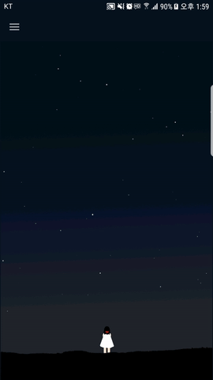
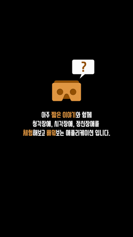

# VR을 활용한 장애체험 App 프로젝트

  

  
 <b>프로젝트의 목적</b> 
 VR을 통해 장애체험을 진행할 수 있는 콘텐츠를 제공하고 안드로이드 App을 통해 
 장애체험이라는 주제에 대해서 좀 더 쉽게 접근할 수 있는 요소를 제공 하는것을 목적으로 하고 있습니다. 
  
 <b>팀 구성</b>  
 VR 콘텐츠 개발자 1명, 안드로이드 개발자 2명 
  
 <b>역할</b> 
 게시판을 제외한 전체적인 어플리케이션의 기획과 Processing을 활용한 애니메이션, 디자인 담당
  

  
   
  <b>[Processing을 이용한 애니메이션 효과와 메뉴화면]</b>

 
<b>기획 포인트</b> 
 메인 콘텐츠는 VR을 이용한 체험이기 때문에 안드로이드 앱에서는 주로 VR에서 체험하는 
 콘텐츠에 대한 정보전달과 접근성을 높이기 위한 서브 콘텐츠 제공을 중점으로 기획했습니다. 
  
 서브 콘텐츠는 VR에서 제공하는 시각,청각,정신장애에 대한 콘텐츠에 맞춘 간략한 스토리를 제공하고 
 스토리 진행에 따라서 달라지는 애니메이션 효과와 VR콘텐츠와 관련된 정보 제공을 목적으로 하고 있습니다. 
  
<b>상세</b> 
 <b>(1)</b> 애니메이션 효과가 나타나는 화면을 메인으로 하고 이곳에서 다른 메뉴들로 접근이 가능합니다. 
 <b>(1.1)</b> 애니메이션 효과의 콘셉은 밤하늘에 빛나는 별 입니다. 
  

  
   
  <b>[어떤 앱인지 간단한 설명을 제공]</b>

 

 <b>(2)</b> 4개의 메뉴가 있고 이곳에서 스토리 진행, 관련 콘텐츠 제공, VR 콘텐츠 체험이 가능합니다. 
 <b>(2.1)</b> 맨 위의 메뉴는 어떤 앱인지에 대한 설명과 대략적인 스토리와 관련된 설명을 제공합니다. 
 <b>(2.2)</b> 나머지 메뉴에서는 스토리 진행을 확인 할 수 있습니다. 
 <b>(2.3)</b> 정보 버튼을 누르는 경우 각 스토리와 관련된 장애에 대한 설명을 제공합니다. 
 <b>(2.4)</b> 체험하기 버튼을 누르는 경우 VR콘텐츠를 체험 할 수 있습니다. 

 

   
  <b>[VR콘텐츠 관련 주의사항 안내]</b>

